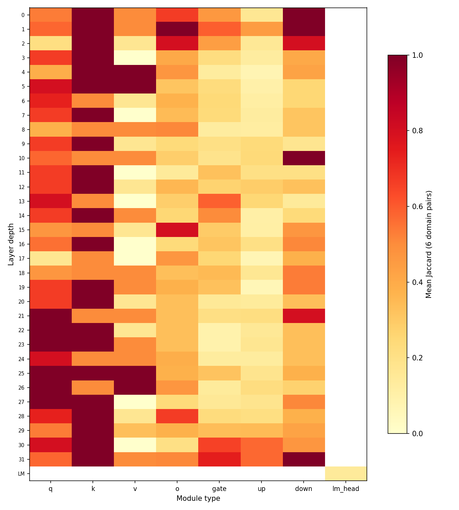
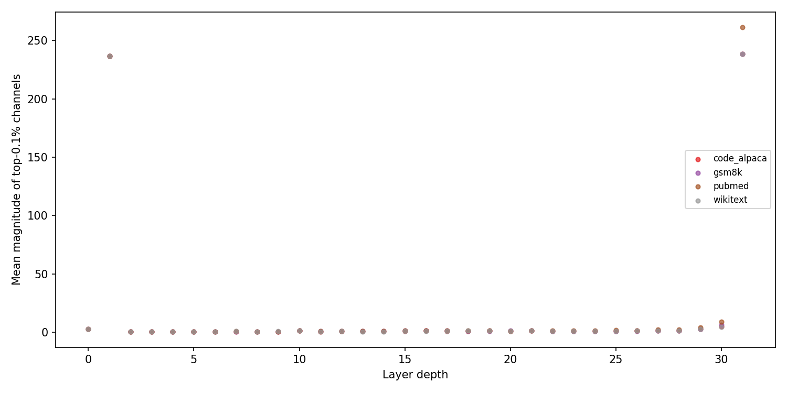
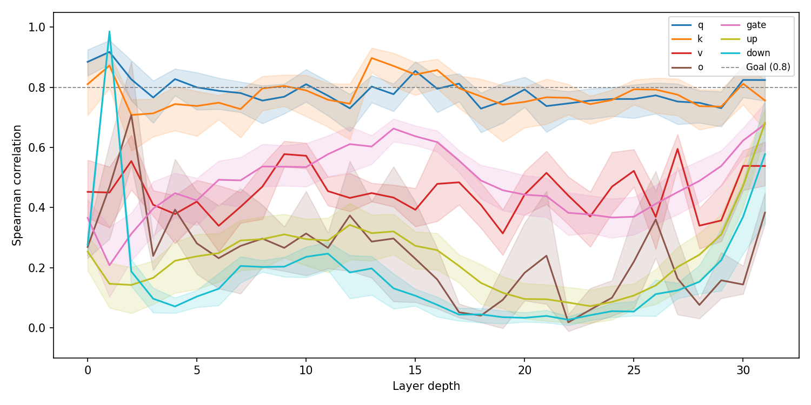

# Activation Outlier Persistence Experiment

Verify the AWQ paper's claim: are activation outliers in LLMs **channel-fixed structural properties of weights**, or artifacts of input distribution?

## Quick Start

```bash
make test       # quick: 1 sample per domain
make run        # full: 128 samples per domain
make resume     # resume latest incomplete run
```

## Pipeline

4 domains (wikitext, GSM8K, code_alpaca, pubmed) → tokenize → Llama-3.1-8B-Instruct forward pass with per-layer hooks → running per-channel max/sum/sumsq on CPU → top-0.1% outlier detection → cross-domain overlap/Jaccard/Spearman.

## Output

```
runs/<timestamp>/
├── args.json               # run configuration
├── results.csv             # per-layer overlap, jaccard, spearman
├── summary.txt             # aggregate metrics
├── code_alpaca/stats.pt    # per-channel stats
├── gsm8k/stats.pt
├── pubmed/stats.pt
├── wikitext/stats.pt
└── plots/
    ├── architecture_heatmap.png
    ├── spearman_by_depth.png
    └── magnitude_scatter.png
```

## CLI

```
--model PATH        model path (default: /home/zyt/sda_ws/models/LLaMA-3.1-8B-Instruct)
-n, --max-samples   samples per domain (default: 128)
--batch-size        inference batch size (default: 1)
--seq-len           sequence length (default: 2048)
--top-k-pct         outlier threshold (default: 0.001)
--resume [TS]       resume latest or specific run
```

## Results (Llama-3.1-8B-Instruct, 128 samples/domain)

Activation outliers are **not a monolith** — their behavior splits sharply by module type and depth.

### Attention K/Q outliers are structurally fixed; MLP outliers are input-dependent



Each cell shows the mean Jaccard similarity of top-0.1% outlier channels across all 6 domain pairs. Dark red = identical channels across code, math, prose, and medical text. Pale yellow = entirely different channels depending on input domain.

| Module | Pattern | Verdict |
|---|---|---|
| `k_proj` | Wall of dark red across all 32 layers | **Strongly fixed** — supports AWQ |
| `q_proj` | Mostly orange/red | **Mostly fixed** |
| `v_proj`, `o_proj` | Mixed, lighter at mid-depth | **Partially input-dependent** |
| `gate_proj`, `up_proj`, `down_proj` | Heavily pale yellow | **Counterexample — not fixed** |

> If you apply static quantization scaling (like AWQ), it will work for K and Q projections, but may severely damage MLP layers where "important" channels shift with the input.

### Outlier magnitude is purely structural



At every single layer, all four domains produce **identical** outlier magnitudes — the dots sit exactly on top of each other. Two massive spikes stand out:

- **Layer 1** (~230 magnitude) — early feature extraction from embeddings
- **Layer 31** (~260 magnitude) — output gathering for `lm_head`

The remaining layers hover near zero in comparison. This confirms that outlier *scale* is rigorously determined by architecture, not input — but it also means boundary layers cannot be quantized the same way as interior layers (200× numerical range difference).

### Middle-depth MLPs are where "thinking" happens



The Spearman rank correlation of full per-channel `max_abs` vectors tells a depth-dependent story:

- **Attention `q` and `k`** stay flat near **0.8** across all depths — the rank ordering of channels is input-independent.
- **MLP modules** (`down_proj`, `gate_proj`, `up_proj`) and **`o_proj`** follow a clear **U-shape**:
  - Layers 0-2: high correlation (universal token processing)
  - Layers 15-23: **collapse to near 0.0** (model activates entirely different pathways for math vs. code vs. prose)
  - Layers 30-31: correlation recovers (output formatting)

> Middle layers (15-25) are where the model "thinks" — solving a math problem uses different MLP channels than generating code. Static outlier assumptions here are a flaw in current quantization paradigms.

### Summary

| Claim | Supported? | Evidence |
|---|---|---|
| Outlier magnitude is structural | ✅ Yes | Magnitude scatter — perfect domain overlap at every layer |
| Attention K/Q channels are fixed | ✅ Yes | Architecture heatmap — consistently high Jaccard |
| All Linear channels are fixed | ❌ No | Architecture heatmap — MLP columns are pale yellow |
| Fixed outliers hold across all depths | ❌ No | Spearman trajectory — MLP collapses in middle layers |

> **"Scale is fixed. Identity depends on the module. Middle-depth MLPs are dynamic."**

## Datasets

| Domain | Source | Field |
|---|---|---|
| wikitext | `Salesforce/wikitext` wikitext-2-raw-v1 | `text` |
| gsm8k | `openai/gsm8k` main | `question` |
| code_alpaca | `flwrlabs/code-alpaca-20k` | instruction+input+output |
| pubmed | `slinusc/PubMedAbstractsSubset` | `abstract` |

## Environment

Python 3.12, PyTorch 2.5.1, Transformers 4.46.3.
